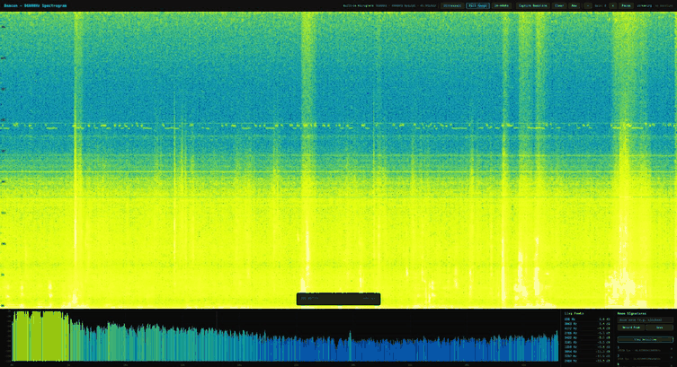

# beacon

Audio-based spatial awareness toolkit for operators who control their own infrastructure.

Define zones by their ambient sound signature or with ultrasonic beacons, detect which zone a device is in, and stream real-time location events — all self-hosted, no cloud, no third-party dependencies.



---

## How It Works

Beacon uses two complementary matching strategies to identify zones. Each zone is defined either by recording its ambient sound (HVAC hum, electrical noise, room resonance) or by a unique ultrasonic beacon WAV emitted from a speaker.

**Hash-based fingerprinting** (inspired by [Shazam's algorithm](https://www.ee.columbia.edu/~dpwe/papers/Wang03-shazam.pdf)) provides precise matching for distinctive audio signatures. **Vector similarity matching** computes a fixed-length feature vector that captures the overall "character" of a room's sound using cosine similarity. Two signature backends are available: a built-in 192-dimensional spectral envelope, and an optional ML-powered backend that runs a pre-trained audio embedding model (e.g., YAMNet — 1024 dimensions) via ONNX Runtime for dramatically better noise robustness. During detection, both fingerprint and signature methods run in parallel and the best match wins.

```
  Audio Input (WAV or Mic)
         │
         ▼
┌─────────────┐     ┌──────────────┐
│  Decode &   │────▶│  FFT-based   │──────────────────────────────────────────┐
│  Resample   │     │  Spectrogram │──────┐                                   │
│  + Filter   │     │  (1024-pt)   │      │                                   │
└─────────────┘     └──────────────┘      │                                   │
                         │                ▼                                   ▼
                         │        ┌───────────────┐                  ┌────────────────┐
                         │        │ Constellation  │                  │   Signature    │
                         │        │ Peak Extraction│                  │   (spectral    │
                         │        │ + Combinatorial│                  │   envelope OR  │
                         │        │ Hashing        │                  │   ML embedding)│
                         │        └───────┬───────┘                  └───────┬────────┘
                         │                │                                  │
              ┌──────────┘                ▼                                  ▼
              │  (if ML)         ┌──────────────┐                  ┌────────────────┐
              ▼                  │  SQLite DB   │                  │  Cosine        │
     ┌──────────────┐            │  (hash →     │                  │  Similarity    │
     │ ONNX Model   │            │   zone +     │                  │  vs stored     │
     │ (e.g. YAMNet)│────────────│   offset)    │                  │  signatures    │
     │ 1024-dim emb │            └──────────────┘                  └────────────────┘
     └──────────────┘
```

1. **Decode & Resample** — Read WAV audio, mix to mono, resample to the target rate for the frequency mode (16 kHz audible, 96 kHz ultrasonic/full).
2. **Band Filter** — Mode-dependent 4th-order Butterworth biquad filters: high-pass at 18 kHz for ultrasonic mode, low-pass at 8 kHz for audible mode, no filter for full spectrum.
3. **Spectrogram** — 1024-sample Hann-windowed STFT with 512-sample hop via `rustfft`.
4. **Constellation Map** — Extract spectral peaks across 6 frequency bands with local maximum detection.
5. **Combinatorial Hashing** — Pair nearby peaks into 64-bit xxHash fingerprints.
6. **Signature** — Compute an L2-normalized feature vector for the audio. Two backends:
   - **Spectral** (default, no extra deps): 192-dimensional vector (64 bands x 3 features: log mean energy, log variance, peak ratio).
   - **ML embedding** (with `--features ml-embeddings`): runs a pre-trained ONNX audio model (e.g., YAMNet) to produce a 1024-dimensional embedding that is far more robust to noise and environmental variation.
7. **Matching** — Hash-based: query hashes are looked up in SQLite, offset histogram alignment identifies the zone. Signature-based: cosine similarity against stored zone signatures (threshold 0.6 for spectral, 0.75 for ML embeddings). Both methods run in parallel; the best result wins.

---

## Installation

```bash
git clone https://github.com/yourname/beacon.git
cd beacon

cargo build --release

# Binary is at ./target/release/beacond
cargo install --path .
```

#### With ML embeddings (optional)

```bash
# Install ONNX Runtime
brew install onnxruntime        # macOS
# or: apt install libonnxruntime-dev  # Debian/Ubuntu

# Build with ML support
cargo build --release --features ml-embeddings

# Set the ONNX Runtime library path
export ORT_DYLIB_PATH=/usr/local/lib/libonnxruntime.dylib  # macOS
# or: export ORT_DYLIB_PATH=/usr/lib/libonnxruntime.so     # Linux

# Run with a model (e.g., YAMNet for 1024-dim audio embeddings)
beacond daemon --monitor --model-path models/yamnet_embedder.onnx
```

Without `--model-path` or without the feature, Beacon falls back to the built-in 192-dim spectral signatures — no ONNX Runtime needed.

For a complete walkthrough on obtaining, converting, and running an ML model, see [MODEL_GUIDE.md](MODEL_GUIDE.md).

### Requirements

- **Rust 1.70+** (stable)
- **Linux**: `libasound2-dev` (ALSA headers for microphone support)
- **macOS / Windows**: No extra system dependencies
- SQLite is bundled via `rusqlite[bundled]`
- Beacon WAV files must be **WAV format** (`.wav`)
- **ML embeddings** (optional): ONNX Runtime shared library + an ONNX audio embedding model

---

## Quick Start

### 1. Run the demo

```bash
beacond demo
```

### 2. Register zones

Record the ambient sound of each room directly from the microphone:

```bash
# Record 10 seconds of ambient audio (default)
beacond zone add kitchen --record --audible
beacond zone add office  --record --audible --duration 15
beacond zone add lobby   --record --audible
```

Or use a pre-recorded WAV file (ultrasonic beacons or ambient recordings):

```bash
beacond zone add kitchen  kitchen_beacon.wav
beacond zone add office   office_recording.wav --audible
```

### 3. List registered zones

```bash
beacond zone list
```

```
  📡 3 zone(s) registered
  ─  ─  ─  ─  ─  ─  ─  ─  ─  ─  ─  ─  ─  ─  ─  ─  ─  ─  ─  ─  ─  ─  ─  ─  ─  ─  ─  ─  ─  ─
  ZONE                  DURATION         FPs          MODE
  ─  ─  ─  ─  ─  ─  ─  ─  ─  ─  ─  ─  ─  ─  ─  ─  ─  ─  ─  ─  ─  ─  ─  ─  ─  ─  ─  ─  ─  ─
  kitchen                  10.0s         487       audible
  lobby                    10.0s         512       audible
  office                   15.0s         493       audible
```

### 4. Detect which zone you're in

```bash
beacond zone detect --duration 3 --audible
```

```
🎤 Using: MacBook Pro Microphone (48000Hz, 2ch)
👂 Listening for 3s (audible)...

  ✅ Captured 3.0s of audio
  🔑 Extracted 312 fingerprints

  📍 Zone detected: kitchen (87% confidence, 218 hits)
```

### 5. Stream live zone events

Start the daemon with monitor mode, then subscribe from another terminal:

```bash
# Terminal 1: Start daemon with continuous mic scanning
beacond daemon --monitor

# Terminal 2: Stream zone events
beacond monitor
```

```json
{"event":"zone_enter","zone":"kitchen","confidence":0.87,"timestamp":"2026-03-21T10:15:30Z"}
{"event":"zone_exit","zone":"kitchen","timestamp":"2026-03-21T10:16:45Z"}
{"event":"zone_enter","zone":"office","confidence":0.92,"timestamp":"2026-03-21T10:16:48Z"}
```

Events are newline-delimited JSON — pipe them to `jq`, a webhook, or your automation system.

### 6. Launch the real-time spectrogram

Visualize live audio from the microphone as a spectrogram in the browser. Captures at native 96 kHz via CPAL, computes 2048-point FFT (1025 bins), and streams magnitude frames at 60 fps via Server-Sent Events:

```bash
beacond spectrogram
# Opens http://127.0.0.1:18924 in your browser

beacond spectrogram --viz-port 9000
```

The spectrogram UI also includes built-in zone management — capture room audio, save as a named zone, and start continuous detection, all from the browser.

---

## Usage

```
beacond <COMMAND> [OPTIONS]

Commands:
  zone          Manage named zones for spatial awareness
    add         Register a zone from a WAV file or by recording ambient audio
    list        List all registered zones
    remove      Remove a zone
    detect      Listen via mic and detect current zone
  daemon        Start the beacon daemon
  monitor       Subscribe to live zone transition events
  ingest        Ingest a WAV file into the fingerprint database
  ingest-dir    Ingest all WAV files in a directory
  recognize     Recognize a WAV audio clip
  listen        Listen via microphone and recognize
  devices       List available audio input devices
  list          List all tracks in the database
  remove        Remove a track from the database
  stats         Show database statistics
  status        Check if daemon is running
  stop          Stop the daemon
  demo          Run a self-test / demo
  spectrogram   Launch real-time spectrogram visualizer in the browser

Global Options:
  --port <PORT>           Daemon port [default: 18923]
  --bind <ADDR>           Bind address [default: 127.0.0.1]
  --db <DB>               Database path [default: ~/.beacond/beacond.db]
  --model-path <PATH>     ONNX audio embedding model (enables ML signatures)
  -v, --verbose           Verbose logging
```

### Frequency Modes

All commands default to **ultrasonic mode** (18 kHz – 48 kHz at 96 kHz sample rate). Two alternative modes are available:

```bash
# Audible mode: standard audio range (20 Hz – 8 kHz at 16 kHz sample rate)
beacond ingest song.wav --title "Bohemian Rhapsody" --artist "Queen" --audible
beacond recognize clip.wav --audible
beacond listen --audible

# Full spectrum mode: all frequencies up to 48 kHz
beacond ingest recording.wav --full-spectrum
beacond recognize clip.wav --full-spectrum
beacond listen --full-spectrum
```

### Direct Mode vs Daemon Mode

Every command works transparently in two modes:

| Mode | When | How |
|------|------|-----|
| **Daemon** | `beacond daemon` is running | CLI connects via TCP |
| **Direct** | No daemon running | CLI opens the database directly |

### Daemon Protocol

The daemon speaks newline-delimited JSON over TCP on `127.0.0.1:18923`:

```bash
# Ping
echo '{"type":"ping"}' | nc localhost 18923

# Zone operations
echo '{"type":"zone_list"}' | nc localhost 18923
echo '{"type":"zone_add","name":"kitchen","path":"/path/to/beacon.wav"}' | nc localhost 18923
echo '{"type":"zone_add","name":"office","record_duration":10,"frequency_mode":"audible"}' | nc localhost 18923
echo '{"type":"zone_remove","name":"kitchen"}' | nc localhost 18923
echo '{"type":"zone_detect","path":"/path/to/recording.wav","frequency_mode":"audible"}' | nc localhost 18923

# Subscribe to monitor events (stays connected)
echo '{"type":"monitor_subscribe"}' | nc localhost 18923

# Legacy audio operations
echo '{"type":"recognize","path":"/path/to/clip.wav"}' | nc localhost 18923
echo '{"type":"ingest","path":"/path/to/song.wav","title":"My Song","artist":"Me"}' | nc localhost 18923

# Shutdown
echo '{"type":"shutdown"}' | nc localhost 18923
```

### Spectrogram Server HTTP API

The `beacond spectrogram` command starts an HTTP server (default port 18924) with the following endpoints:

| Method | Path | Description |
|--------|------|-------------|
| GET | `/` | HTML/JS spectrogram visualization UI |
| GET | `/stream` | SSE stream of spectrogram magnitude frames |
| GET | `/info` | Device and FFT configuration info (JSON) |
| POST | `/zone/capture/start` | Begin capturing room audio for a new zone |
| POST | `/zone/capture/stop` | Stop capturing and return sample count |
| POST | `/zone/save` | Save captured audio as a named zone (body: `{"name":"..."}`) |
| GET | `/zones` | List all registered zones |
| POST | `/zone/detect/start` | Start continuous zone detection loop |
| POST | `/zone/detect/stop` | Stop continuous detection |
| GET | `/zone/detect/once` | Run a single detection pass |
| GET | `/zone/events` | SSE stream of zone detection events |

---

## Architecture

```
src/
├── main.rs               # Entry point → beacon::cli::execute()
├── lib.rs                # Module declarations
├── audio.rs              # WAV decoding, resampling, Butterworth biquad filters, tone generation
├── spectrogram.rs        # FFT-based spectrogram (Hann window, configurable size/hop)
├── fingerprint.rs        # Constellation peak finding + combinatorial hashing (xxh3)
├── signature.rs          # Sound signatures: variable-dim vectors + cosine similarity
├── embeddings.rs         # [ml-embeddings] ONNX audio embedding model (YAMNet, OpenL3, etc.)
├── database.rs           # SQLite storage, offset-histogram search, zone management
├── daemon.rs             # TCP daemon, JSON protocol, monitor loop, event broadcast
├── microphone.rs         # Live mic capture via CPAL, sample rate negotiation
├── spectrogram_server.rs # Real-time spectrogram visualizer + zone capture/detection HTTP API
└── cli.rs                # CLI with zone commands, colored output, progress bars
```

### Key Dependencies

| Crate | Purpose |
|-------|---------|
| `rustfft` | FFT for spectrograms |
| `hound` | WAV file I/O |
| `cpal` | Cross-platform mic capture (ALSA/CoreAudio/WASAPI) |
| `rusqlite` | SQLite (bundled, zero system deps) |
| `tokio` | Async runtime + broadcast channels for event streaming |
| `clap` | CLI argument parsing |
| `xxhash-rust` | 64-bit fingerprint hashing |
| `serde` / `serde_json` | Serialization for daemon protocol and config |
| `anyhow` / `thiserror` | Error handling |
| `colored` / `indicatif` | CLI colors and progress bars |
| `chrono` | Timestamps for zone events |
| `byteorder` | Binary serialization for signature vectors |
| `ort` | (optional) ONNX Runtime bindings for ML audio embeddings |
| `ndarray` | (optional) N-dimensional array for model I/O |

---

## Hardware Requirements

- **Microphone**: Any mic works for ambient mode. For ultrasonic mode, the mic must support >= 44.1 kHz sample rate (most built-in and USB mics do). Run `beacond devices` to check.
- **Speakers** (ultrasonic mode only): Standard tweeters roll off around 20 kHz. Piezo or parametric speakers work better for 20-40 kHz. Not needed for ambient sound signatures.
- Ultrasonic beacon WAV files should be generated at 96 kHz sample rate with content above 18 kHz.

---

## Tuning

### Fingerprinting parameters (`FingerprintConfig`)

| Parameter | Default | Effect |
|-----------|---------|--------|
| `window_size` | 1024 | FFT window size |
| `hop_size` | 512 | Frame overlap |
| `num_bands` | 6 | Frequency bands for peak extraction |
| `max_peaks_per_band` | 3 | Peaks per band per frame |
| `peak_threshold` | 0.01 | Minimum peak magnitude |
| `target_zone_t_min/max` | 1 / 60 | Time range (frames) for peak pairing |
| `target_zone_f_range` | 100 | Frequency range (bins) for peak pairing |
| `max_pairs_per_anchor` | 5 | Hash pairs per anchor peak |

Local maximum detection uses a neighbourhood of 5 frames x 5 bins on each side.

### Signature parameters

**Spectral backend** (`signature.rs`):

| Parameter | Default | Effect |
|-----------|---------|--------|
| `NUM_BANDS` | 64 | Frequency bands in the signature |
| `FEATURES_PER_BAND` | 3 | Features per band (log mean, log variance, peak ratio) |
| Vector length | 192 | Total signature dimensions (64 x 3) |
| Similarity threshold | 0.6 | Minimum cosine similarity for a zone match |

**ML embedding backend** (`embeddings.rs`, requires `--features ml-embeddings`):

| Parameter | Default | Effect |
|-----------|---------|--------|
| Model sample rate | 16 kHz | Audio is resampled to this rate before inference |
| Vector length | model-dependent | 1024 for YAMNet, 512 for OpenL3 |
| Similarity threshold | 0.75 | Higher threshold for learned embeddings |
| Frame alignment | 160 samples | Input zero-padded to this boundary |

### Matching thresholds

| Parameter | Value | Location |
|-----------|-------|----------|
| Min hash hits for match | 5 | `database.rs` — offset histogram peak minimum |
| Min confidence (monitor) | 0.05 | `daemon.rs` — hash-based monitor loop |
| Min similarity (spectral) | 0.6 | `daemon.rs` — spectral signature matching |
| Min similarity (ML) | 0.75 | `daemon.rs` — learned embedding matching |

---

## Running Tests

```bash
cargo test                              # Base tests (no ONNX Runtime needed)
cargo test --features ml-embeddings     # Include embedding module tests
```

---

## Documentation

For detailed documentation and wiki, see [DeepWiki — beacond](https://deepwiki.com/swiftugandan/beacond).

---

## License

MIT
